# AWS and Cloud Computing

* We will be using AWS Cloud9 as our **development environment**.
* It's easy. It's cheap. It can be accessed from anywhere (as long as you have an internet connection). And it's more than enough to build a full stack application (and career!) on.
* Bonus: We get introduced to **cloud computing** the **AWS** ecosystem.
* Cloud Computing has fundamentally changed the way that we design, deploy, and use software.
* AWS is the global leader in **_cloud computing_** and it's not even close.
* Here's how Amazon define's cloud computing:
> Cloud computing is the on-demand delivery of compute power, database, storage, applications, and other IT resources via the internet with pay-as-you-go pricing.
> Whether you are using it to run applications that share photos to millions of mobile users or to support business critical operations, a cloud services platform provides rapid access to flexible and low cost IT resources. With cloud computing, you don’t need to make large upfront investments in hardware and spend a lot of time on the heavy lifting of managing that hardware. Instead, you can provision exactly the right type and size of computing resources you need to power your newest idea or operate your IT department. You can access as many resources as you need, almost instantly, and only pay for what you use.

### Cloud9 and the AWS Ecosystem

* Cloud9 is "a cloud-based integrated development environment (IDE) that you use to write, run, and debug code".
  * An integrated development environment is an application that provides all the tools you need for software development in one location. They include a terminal, a text editor, and a graphical directory tree.
* Instead of running your code on your physical computer, Cloud9 creates a **_virtual machine_** for your code to run on.
* Cloud9 is just one of **over 100 services** that AWS offers to allow you to build software, secure it, and deploy it to the world.

# Setting Up Our Development Environment

The reason we are having you create an AWS account and do all of your coding in Cloud9 is because it is more beginner friendly than having to code directly on your computer. Cloud9 is a step up from a simple IDE like [Repl.it](https://replit.com/). With Cloud9, you can create an entire folder and file structure just like you can on a regular computer. You can also execute files, use the terminal to navigate your folders, and preview files like a regular computer. But most importantly, Cloud9 offers a consistent coding environment that you and your instructors can easily troubleshoot if you run into problems!

For now, both you and your instructors will only be coding almost exclusively on AWS. Later on in the curriculum, once you gain more coding experience and begin to create robust web applications, you will transition to developing on your local computers. **You will only need to create one Cloud9 Environment** during your time at Marcy Lab. You will code all of your work and assignments on this virutal machine. 

0. A Marcy Lab School staff member has sent you an email containing the link to sign into your AWS account. The same email should also contain your username and a temporary password.
1. Log into your AWS account using the link and credentials sent to your email. 
2. Change your password.
3. Once logged in, in the "Search for Services" search bar, type in "Cloud9".
4. Once at the Cloud9 homepage, click 'Create Environment'
5. Create your Cloud9 environment, this will act as **your virtual computer for all of your Marcy Lab work** for your first semester.
  * **Step 1: Name Environment**
  
    Name: _FirstName-LastName-MarcyLab_ 
    
    > Example: Ben-Spector-MarcyLab
    
    Description: This is the development environment for my Marcy Lab School projects and assignments.
    
  * **Step 2: Configure Settings**
  
    For **Instance type**, choose **t3.small (2 GiB RAM + 2 vCPU)**. Leave all other settings as they are and click 'Next Step'.
    
  * **Step 3: Review**
  
    Create environment
    
6. Wait a minute while the environment configures. Once it's loaded, **save the link to your bookmarks!** It will be very useful in the future.

## Touring the IDE

### Exploring the User Interface

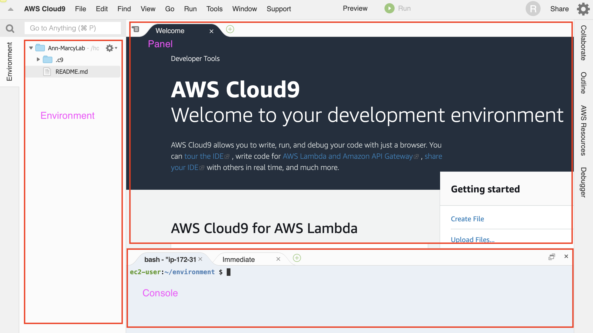

On the left, the Environment is where you can see the directories and files in your Cloud9 environment. You can right click in this area to manually create new files and folders.

### Manipulating your directory tree using the integrated terminal

Although you can create files and folder using the left side bar, developers who use the Command Line can create files and folders very efficiently.

The first tab in your console is your terminal (command line interface). In your terminal, type `pwd` and press Enter to see your working directory. Type `ls` and Enter to view your files. Since you'll be developing in this environment for a couple months, let's get organized. Create a folder called Unit-0 using the command `mkdir Unit-0`, a place where you can save all your Unit 0 work.

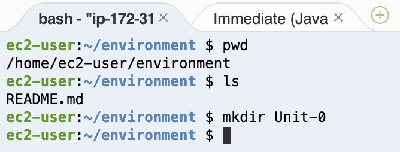

### Creating and opening a file

Next, type `cd Unit-0` to change directories your new `Unit-0` folder and create a JavaScript file called app.js. Use the command `touch app.js`. Next, we are going to install some Cloud9 tools. Type `npm install -g c9` in the terminal. The npm install part of the command is installing a tool called c9, and the -g flag installs it globally on our Cloud9 environment.

Now, you can type `c9 <filename>` to open any file from the terminal. The file will appear in the Cloud9 panel. Open your new file with the command `c9 app.js`. **Double check that your directory structure looks like below.** You might not see the `.c9` folder since it's a hidden directory. 

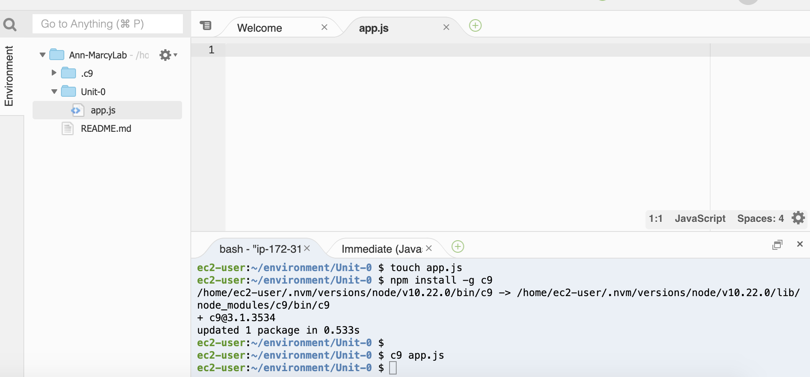

### Running a JavaScript file

Now that you can edit files, create a JavaScript function that will `console.log` "hello world". Be sure to invoked that function in your `app.js` file. Save the file using Control-S or Command-S on your keyboard. Next, type `node app.js` to run the JavaScript file. Node is the tool developers use to run JavaScript. Ensure that the string "hello world" is printed to your terminal.

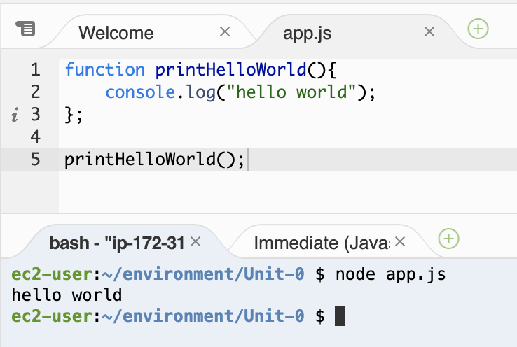

### Interacting with the built-in JavaScript console

Click on the second tab of your console where it says "Immediate". This tab can be used as a JavaScript console. Create variables `firstName` and `lastName` and see if you can `console.log` your full name. Follow the example below:

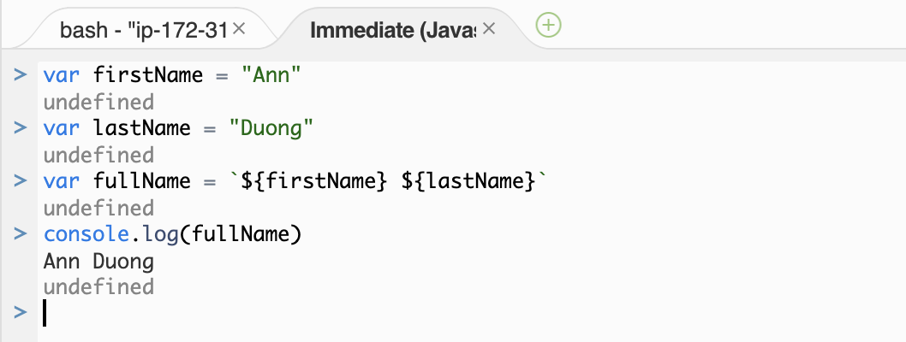

**Note:** Every time you press enter, the JavaScript code is executed as a block. So you'll need to declared variables with `var` if you want their scope to persist between when you press "Enter". In order to write multiple JS lines at once, hold down "Shift" as you press "Enter" for a new line.

### Enable AutoSave

Click on AWS Cloud9 from the menu bar and click on Preferences.

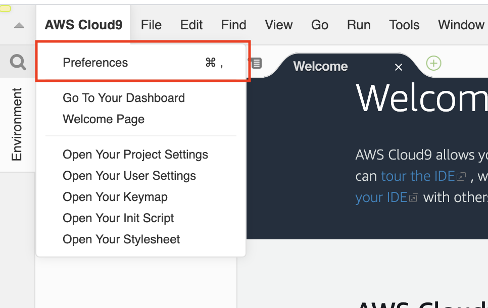

Navigate to EXPERIMENTAL. Choosing On Focus Change will save a file any time you click away from it.  

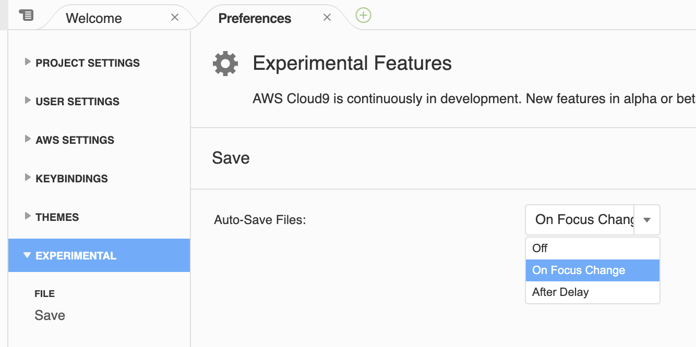

### Additional Exploration

Take some time to explore other features of Cloud 9. You can even change the color theme of your environment.

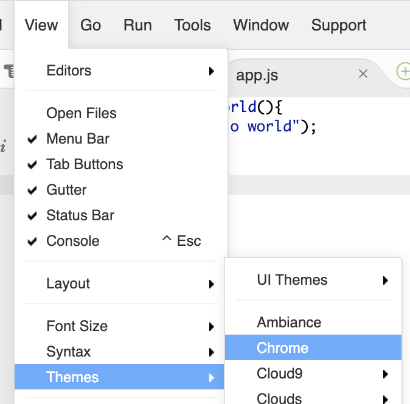


# Configure Your Github Account in AWS Cloud9

You will be using Github individually and collaboratively. We will set up your Cloud9
virutal machine to be able to communicate with your Github account. You'll be able to clone code from a
remote repo using SSH and make changes to it on your virtual machine.

### Create a Github Account

[Create a Github Account](https://github.com/join). If you already have one, you can skip to the next step.

### Configure Github in the AWS Terminal

1. Open up your Cloud9 environment. Run the following lines in the terminal, **replacing the username and email with your Github username and email**:

```sh
git config --global user.name "Your Github Username"
git config --global user.email "Your Github Email Address"
git config --global credential.helper store
```

2. Confirm that the configuration was successful by running `git config --global user.name`. The terminal should print out your name. Next, run `git config --global user.email`. The terminal should print our your email address. If the user.name and/or user.email are incorrect, you can always reconfigure by repeating the steps noted. 

### Create a Repository on Github

1. Navigate to Github in the browser and log in. ON the left, click the button to create a new repository.

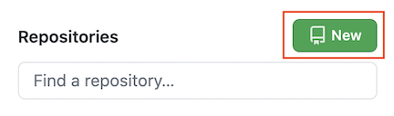

2. Name your repository `my-first-repo`. Choose to add a README.md file. Create the repository.

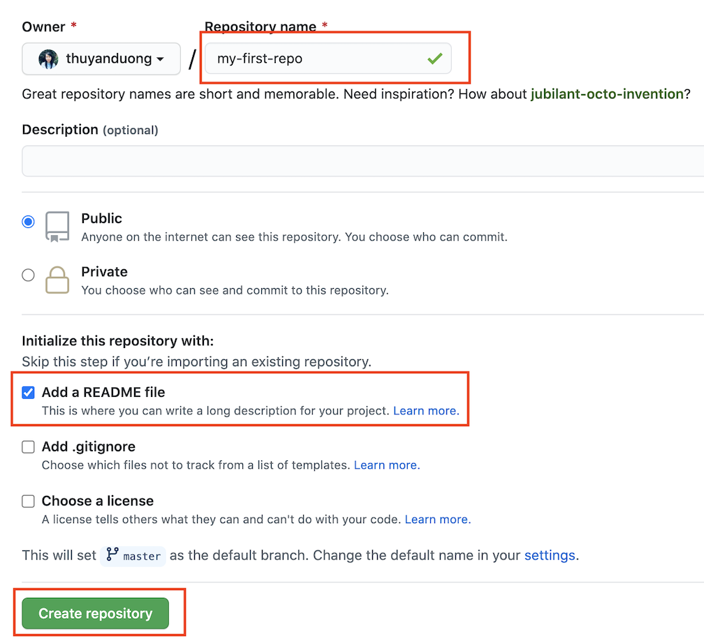

### Add SSH Key

While we're configuring GitHub, we should add a new SSH key. 

1. First, check if you already have an SSH key by running `cat ~/.ssh/id_rsa.pub` in your terminal. If the terminal prints out a long string of characters starting with ssh-rsa, you've already got a key.

2. If the running previous step printed "No such file or directory", then run `ssh-keygen` in your terminal to create a key. You should be prompted to select a file and passphrase for your new key. Leave everything blank and press enter for the default location and no passphrase. If you’re asked if you want to overwrite, then you already have an SSH key, and you do not want to overwrite it. If you've done every correctly, you should be something like this printed to your terminal:

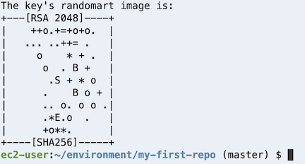

Run `cat ~/.ssh/id_rsa.pub` in your terminal. Copy the output (starting from `ssh-rsa` and every character that follows). You'll need it for the next step

3. Navigate to the homepage of Github in your browser. Go to your account settings:

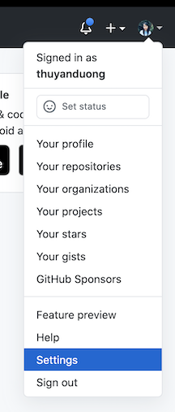

Click "SSH and GPG Keys":

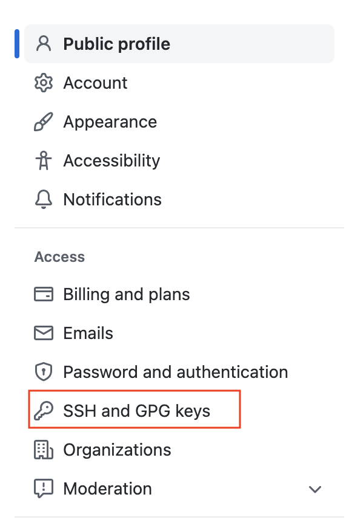

Click the "New SSH key" button:

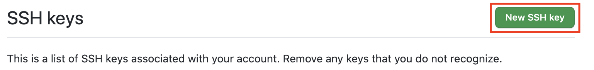

Put whatever you want for the title, but preferably something related to C9 since that's the machine that has this key. Paste the key in the text area and click "Add SSH key".

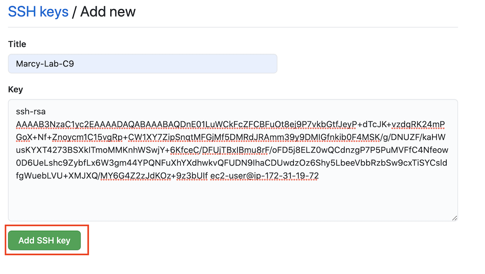

### Clone Using SSH

1. Go back to your repository on Github. Then, click on the Code button and make sure the pop-up has "SSH" underlined and selected. The url should start with `git@github.com:...`. If this is not the case, click the link that say `SSH`. Copy that URL in the text box.

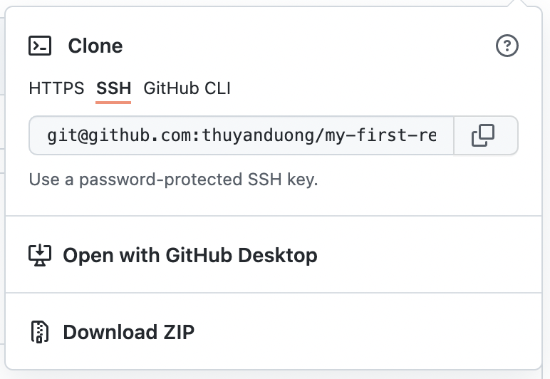

2. Back in your Cloud9 terminal, make sure that you have a `Unit-0` folder and that your "working directory" is your `Unit-0` folder. If not, `cd Unit-0` to jump into it. Clone down the project using `git clone <ssh_url>`, using the URL you copied from the previous step. If asked, "Are you sure you want to continue connecting", type `yes`. 

3. Then change directory into your project `cd my-first-repo` or whatever you named your repository. 

4. Once your repo can been cloned down, use the Cloud9 IDE to update the `README.md` inside of your `my-first-repo` project. **Add a 3-4 sentence bio about yourself**. Be sure to save the file.

5. Push the changes back up to Github using best practices. In the terminal, run:
```sh
git status
git add README.md
git commit -m "added bio"
git push
```
6. Go back to Github to view your repository in the browser. Refresh the page and confirm that you see your newly added bio!

