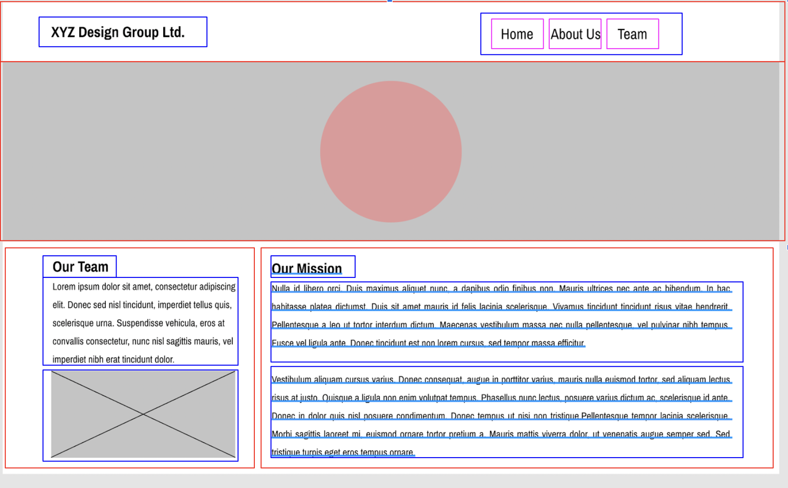

## Everything is a box

When Looking at a site we need to remember

### HTML

The Hyper Text Markup Langue, better know as HTML, is the tool Developer usually use the build the stuctor of a website. Once you are able to reconise all of the boxes that need to be on your project you can code them in to you .html document.

*HTML5* (the most current version) added Semantic Tags.
* Semantic Tags are more expressive divisions. They are still boxes but they convey additional meaning.
* Structurally semantic tags include: `<section>`, `<article>`, `<nav>`, `<header>`, `<footer>`, `<aside>`, `<main>`
* Other new semantic tags include: `<figure>`, `<figcaption>`, `<blockquote>`
* Lastly, we are very familiar with the following semantic tags: `<p>`, `<h1>…<h6>`, `<ul>`, `<li>`, `<strong>`, `<em>`
* Non-semantic tags: `<div>`, `<span>`, `<b>`, `<i>`
These tags don’t give any information about what’s inside.

#### Why we use them:

* Make it easier to read and write our code
* Helps with accessibility 
* Search optimization  

## CSS
Stands for *Cascading Style Sheets*. It is the language used to add style (color, font, spacing) to the elements of a website. CSS is typically written in .css files and referenced by .html files using the `<link>` tag. (note: you must ensure the .css file has the same file name as the one in your link tag.)
```HTML
<link rel="stylesheet" href="styles.css">
```
### Selector and Sepcificity

* Selectors have something calles a sepcificity weight, which determains the superiority a selector is given when a styling conflict occurs. 
* A tag holds a low point value of 0-0-1
* A Class holds a point value of 0-1-0.
* An ID  holds a point value of 1-0-0
    * The higher the specificity weight of a selector, the more superiority the selector is given when a styling conflict occurs.
    * Example
    
*   Combined selectors will be read from right to left by the browser. The selector farthest to the right is known as the _key selector_. Any selector to the left of the key selector will serve as a _prequalifier_.
  * Example:
    ```CSS
    .hotdog, p, ul, a {
        background: brown;
    }	
    ```
    This is important to know becuase this will effect the speed in which your your project loads into the browser. Depening how you use this can slow it down.

### Box model 


#### Things to remember
 * The box model is based on the `margin`, `border` and `padding` around the content of block and inlin-block elements. 
 * The width and height properties only effect the content size. `margin`, `border` and `padding` will not be effected.
 * Always take in to consideration margin colaps when thinking about your designs. When 2 block elements are stacked on top of eachother only, the larger margin of the 2 will be the one displayed. 
### Visual Formating Model
##### Things to remember
* There are 3 type of elements, `block`, `inline`, and `inline-block`. [Click here for a list of block and inline elements](https://www.w3schools.com/html/html_blocks.asp)
* A `block` take up the whole row
* `inline` does not take up the whole row will not take on box model properties
* `inline-block` will take up box model properties but will not take up the whole row, there for can be inline.

# Floats
* Elements float within their immediate container, which puts a limit on how far the browser can move the floated element. 
  * If you float two elements in a row in the same direction, their vertical edges (counting their margins) will touch, providing they fit in the same row.
  * Any whitespace (other than margins and padding) that would otherwise appear between the elements will collapse.

## Contain Floats
* The browser removes floats from the normal document flow, and that means the container no longer contains the floated items. 
  * Hence, the browser cannot determine the container's height, so it can't render the container correctly.
  * Solution: `overflow: hidden` (or `overflow: auto`) is the simplest way to clear a floated element. 
    * Apply the property to the container element and watch it expand to wrap your floated elements.

* Instead of an `overflow` propery, a *clearfix* can be applied to a container.
  * A clearfix is a standard pattern that developers use to ensure a container doesn't lose its floated children. 
  * It employs an invisible block element as the last child element of the container and the clear property.  
  
  ```css
    #columns::after { /* This rule is the clearfix */
    clear: both;
    content: "";
    display: block;
    }
  ```
  * In the example above, a new `block` child element (`""`) is added to the end of the #columns element.
  * The `clear: both` css property then has the new `block` element clear all floated elements. 
  * This empty/invisible `block` element sits below any floated elements, thus the container contains it. 
* *Note:* When you float an element, it uses as much space as it needs to display its content

# Positioning
## Offset Properties
* `top`, `bottom`, `left`, `right`
* Each offset measures the inward distance from the side of the container named by the offset property. 
* For instance, `bottom: 50px` indicates a position 50px inward from (above) the bottom edge of the container. 
* _* Remember that the offset is always inward when working with positive offset values. Negative offsets shift elements in the opposite direction.*_

## The `position` property
### `position: static`
* The default. statically positioned items are part of the page flow. 
* They appear in the same order they appear in the markup. 
* The offset properties do not affect static elements.

### `position: relative`
* Relative positioning moves an element to a new position relative to where the browser would otherwise put it. 
* For example, if you include `left: 50px` and `bottom: 100px` with `position: relative`, the browser will shift the element 50px inward from the left edge and 100px upward from the bottom edge from where the browser would place it otherwise.
* *Relative positioning does not remove an item from the document flow.* 
  * The browser positions the next element as though the previous one still occupied its pre-offset location.

### `position: absolute`
* Absolute positioning causes the browser to move the element to a new position within a container element.
* By default, the container is the nearest ancestor element that has a `relative`, `absolute`, or `sticky` position
* If no ancestor container is present, `body` is used.
* *Absolute positioning removes elements from the normal document flow.* No matter where you position it, the browser won't treat that space as occupied space.

### `position: fixed`
* Fixed positioningsets an element to a fixed position within the window. 
* The element does not move if the user scrolls the page. (Think navigation bar at the top of a page.)
