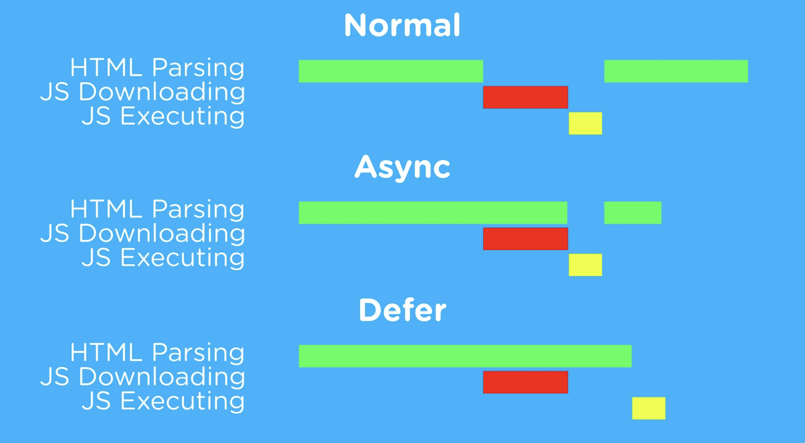

# Events and Timers

## Quick Review of `DOMContentLoaded`

One of the things that we learned is that we need to keep the `<script>` tag in the `<head>` tag. We also learned that in order to access elements from our HTML file we would need to use the `DOMContentLoaded` listener. Below is another example of why/how you would use this syntax. 


```HTML
<button>Click Me!</button>
```

```js
document.addEventListener('DOMContentLoaded', () => {
  const button = document.querySelector('button'); //dependant on the HTML
  button.addEventListener('click', print)
});
// the rest has nothing to do with the HTML.
let testString = 'test';
let testCount = 0;
function print(){
  testCount++
  console.log(testString+testCount);
}
```

Notice that when we run this we can use the `print` function independent of the HTML file. 

## What about using `defer`

In the last lecture we talked about *parsing*, but I didn't mention the word. Parsing means analyzing and converting a program into an internal format that a runtime environment can actually run, for example the JavaScript engine inside browsers. The browser parses HTML into a DOM tree. HTML parsing involves tokenization and tree construction.

In plain English: how the HTML and JS files are loaded by the browser.



## `e` and `e.target`

When we learned about adding event listeners to our page, we had something that looked like this:

```js
  document.getElementById("myBtn3").addEventListener("click", function(){buttonClick(clickCount3)});
```
What if I told you there was a better way. As always we are going to teach the way things use to be done and you may still see, but then we will teach how to do it even better. 

```js
element.addEventListener('click', (e) =>{
  //code
})
```
The `e` represents the event and it is an object that has information of the event. Let take a look at what we can see when we console.log the event.

```js
button.addEventListener('click')
```

You might be asking well why is this better, or what are the benefits.

Some times you might not know where the event is happening? We'll talk more about this when we talk about bubbling.

## bubbling and capturing

When you have element one over the other you might have something called bubbling and capturing. 

Bubbling is when code runs from the inner most element to the outer.

Capturing does it from the outer most to the inner most element.

## Intervals and time out

```js
const intervalID = setInterval(myCallback, 500, 'Parameter 1', 'Parameter 2');

function myCallback(a, b)
{
 // Your code here
 // Parameters are purely optional.
 console.log(a);
 console.log(b);
}
```

```js
setTimeout(() => {
  console.log("Delayed for 1 second.");
}, "1000")
```

