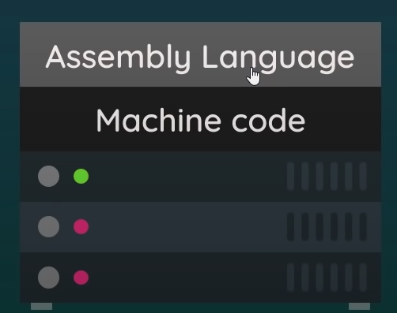
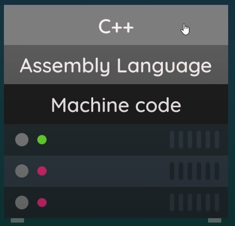
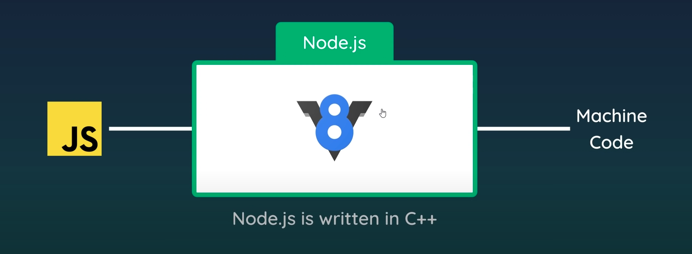

# Intro to Node

**Pre-req / learning**
* https://www.codecademy.com/learn/learn-node-js

**Topics**
* Node
* `package.json`
* npm
* module.exports / require (CommonJS)
* `export` and `import` (ES6)
* Environment variables

## Node

Node.js is an open-source, cross-platform, server-side JavaScript runtime environment. It runs without a Browser (no UI).

Code that is started using the terminal.

Normally we use the Browser to run our JavaScript code. This is the way that it was originally intended to be used. This was done by using the V8 engine (in chrome browsers). Meaning that there was no way to run JavaScript on your computer. 

### How does Code run on a computer



Then people abstracted assembly code and made C++, which made it much easier for people to be able to write code that will run on your computer.



When JavaScript was first introduced it was for web browsers only.  Each modern web browser comes bundled with a JavaScript runtime. Chrome uses an engine called V8, while Firefox uses SpiderMonkey and Safari uses WebKit/JavaScriptCore. 


This engine translates the JavaScript into C++ which then the computer does the rest. 

### So, what about node?



Node was build on the V8 engine. This is what allows computers to run JavaScript. 

### So Why Should I know how to use Node.js?

We have spent all the this time learning how to code JavaScript so that we can make the front-end of web application. We can learn PHP, Python, Ruby, C#, Java, or many other langues, to runs servers, or we can just use JavaScript which we have learned and know how to use already. 

## Starting a Project

1. `npm init` to create a node project and create a `package.json` file
    * You can also do `npm init -y` that set everything up with the defaults. 
2. Create `app.js` as your "entry point" file
3. Add a `"start"` script to `package.json`: `"start": "node app.js"`
4. Run `npm start`

```
npm init

package name: (app-folder) //name of the folder(no spaces)
description: // what is this about
entry point: // the name of the main JavaScript file. (app.js)
test command: 
git repository: //repo file/url path
author: //Your name
license: //
(ISC) if there is any
Is this OK? (yes) // y or n
```

## Node Package Manager

`npm` is a command-line tool that lets us download **packages**

A **package** is a collection of files that we can download and import into our projects to add a specific functionality to our program.

Examples of NPM packages:
* https://www.npmjs.com/package/superheroes
* https://www.npmjs.com/package/supervillains

#### Installing Packages

* `npm install package-name` is the syntax for installing packages for the current project.

    * Ex: `npm install superheroes`

* `npm i package-name` is the shorthand syntax for installing.
    * Ex: `npm i superheroes`

* `npm i -D package-name` uses the `-D` developer flag which installs packages as a **developer dependency**. 
    * Ex: `npm i -D nodemon`

### nodemon

nodemon is a tool that helps develop Node.js based applications by automatically restarting the node application when file changes in the directory are detected.


We can import packages installed via `npm` using `require()`. When doing this, we ONLY provide the name of the package

```js
// app.js
const superheroes = require('superheroes');
const randomHero = superheroes.random();
console.log(randomHero);
```

## Exports / Require (CommonJS)

In Node.js, each file is considered a separate module, and a module can export one or more values that can be imported and used in other modules. The values that a module exports can be functions, objects, classes, or other data types.

Here is how we can create our own local modules!

1. Create a `utils.js` file with functions and variables
2. Export with `module.exports`

```js
// utils.js
const rollDie = () => {
    return Math.ceil(Math.random() * 6);
}
const INSTRUCTOR_NAME = "GONZALO";
module.exports = {
    rollDie,
    INSTRUCTOR_NAME
}
```

3. In `app.js`, import functions and variables using `require` and the **relative path**:

```js
// In app.js
//module example 1
// Using dot notation
const utils = require("./utils"); // get the whole object
const roll = utils.rollDie();//use dot notation to get the values

console.log(`${utils.INSTRUCTOR_NAME} rolled a ${roll}`);

// Using destructuring
const { rollDie, INSTRUCTOR_NAME } = require("./utils"); 
const roll = rollDie()

console.log(`${INSTRUCTOR_NAME} rolled a ${roll}`)
```

### Note
* When you are importing your modules, you can get the whole object and use dot notation to access the values, or you can use destructuring to create variables that you can use. 

* Depending on how many values you are importing one might be better than the other, but you should also be consistent with the one you use. 

```js
// In app.js
//module example 2

// Using dot notation
const logger = require('./logger')
logger.log(logger.URL);

// Using destructuring
const { log, URL } = require('./logger');
log(URL);

```

## Environment Variables

Environment variables provide information about the environment in which the process is running. We use Node environment variables to handle sensitive data like passwords, which we shouldn't hard code, or configuration details that might change between runs, like what port a server should listen on.

In setting environment variables, there are two way you can go about it: 

You can just make a `.env` and 

API key: secret stuff
Environment:config stuff

First install `npm i dotenv`

* `port=8080 host='127.0.0.1' node index.js`
* `process.env`

## nodemon

nodemon is a tool that helps develop Node.js based applications by automatically restarting the node application when file changes in the directory are detected.

```
npm install -g nodemon

// or

npm install --save-dev nodemon
```